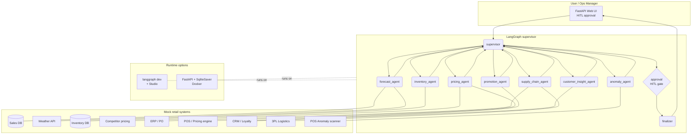

# SOA Retail Agent

**Smart Operations Agent for retail** — a multi-agent system built with
[LangGraph](https://langchain-ai.github.io/langgraph/), backed by a **local
Ollama LLM** (no cloud lock-in), runnable both with `langgraph dev` (for
visualization in LangGraph Studio) and as a **self-hosted FastAPI container**
(deployable to Azure Container Apps, AWS ECS, on-prem K8s, etc.).

> **Runtime constraint:** This project deliberately avoids Azure AI Foundry as
> a runtime. The whole stack runs on LangGraph-native runtimes only:
> `langgraph dev` for development and a self-hosted FastAPI/Docker container
> for production.

---

## 1. The use case

A regional retail chain wants to react in real time to operational signals —
demand spikes, stockouts, pricing pressure, fraud — without waiting for daily
batch reports. The SOA Retail Agent orchestrates seven specialist agents under
a supervisor and **pauses for human approval** before executing high-impact
actions (price changes, purchase orders, promotional campaigns).

### Demo scenario (baked into the data)

A **heatwave** is forecast for Mumbai. The `sales.csv` fixture already shows
escalating beverage demand at store `S001`. When you ask the agent:

> *"Heatwave warning in Mumbai. Make sure we don't stock out on cold
> beverages and consider a promo for loyalty customers."*

the supervisor sequences:

`forecast → inventory → pricing → promotion → supply_chain → anomaly → finalize`

and pauses for **human approval** before the pricing, promotion, and supply
chain actions execute.

---

## 2. Architecture



The same `graph` symbol (in `soa_retail_agent/graph.py`) is used by both
runtimes — no code branching for dev vs prod.

---

## 3. Repository layout

```
DeepAgents/
├── Dockerfile
├── docker-compose.yml          # Ollama + SOA app
├── langgraph.json              # LangGraph Studio entrypoint
├── pyproject.toml
├── requirements.txt
├── .env.example
├── README.md
├── soa_retail_agent/
│   ├── __init__.py
│   ├── config.py               # env loading
│   ├── llm.py                  # Ollama factory
│   ├── state.py                # shared RetailState
│   ├── graph.py                # supervisor + workers + HITL  (exports `graph`)
│   ├── agents/                 # 7 specialists (forecast, inventory, ...)
│   │   ├── _base.py            # ReAct agent wrapper
│   │   └── *_agent.py
│   ├── tools/                  # mock retail systems (14 @tool functions)
│   ├── data/                   # synthetic CSV fixtures
│   └── api/                    # FastAPI runner + HTML template
└── tests/
    ├── test_tools.py
    └── test_graph.py
```

---

## 4. Quick start

### Prerequisites

- Python **3.11**
- [Ollama](https://ollama.com) installed locally **OR** Docker Desktop

### A. Run locally with `langgraph dev` (visualize in Studio)

```powershell
# 1. Pull the model (one-time)
ollama pull llama3.1:8b

# 2. Create venv & install
python -m venv .venv
.\.venv\Scripts\Activate.ps1
pip install -r requirements.txt
pip install -e .

# 3. Copy .env
Copy-Item .env.example .env

# 4. Launch LangGraph dev server (opens Studio)
langgraph dev
```

LangGraph Studio will load the `soa_retail` graph from `langgraph.json` and
let you trace runs visually.

### B. Run locally as FastAPI

```powershell
uvicorn soa_retail_agent.api.main:app --reload --port 8080
```

Then open <http://localhost:8080> for the HITL approval UI.

### C. Run as a Docker container (production-style)

```powershell
docker compose up --build
# Pull the model into the ollama container (one-time)
docker exec -it soa-ollama ollama pull llama3.1:8b
```

Open <http://localhost:8080>.

---

## 5. Configuration

All settings come from `.env` (see `.env.example`):

| Variable | Default | Meaning |
|---|---|---|
| `OLLAMA_BASE_URL` | `http://localhost:11434` | Ollama endpoint |
| `OLLAMA_MODEL` | `llama3.1:8b` | Local model name |
| `LLM_TEMPERATURE` | `0.2` | Sampling temperature |
| `CHECKPOINT_DB` | `./checkpoints.sqlite` | SQLite file for HITL state |
| `API_HOST` / `API_PORT` | `0.0.0.0` / `8080` | FastAPI bind |
| `APPROVAL_REQUIRED` | `true` | Pause before high-risk actions |
| `LANGSMITH_TRACING` | `false` | Optional LangSmith traces |

---

## 6. Tests

```powershell
pytest -q
```

- `test_tools.py` — exercises all 14 mock tools against the CSV fixtures.
- `test_graph.py` — smoke-tests that the LangGraph compiles and exposes
  the `graph` symbol with all expected nodes.

Tests do **not** call the LLM, so they run in seconds without Ollama.

---

## 7. Deployment options (LangGraph-native, no Foundry)

Because the runtime is a vanilla FastAPI + LangGraph container, you can ship
it to any of these without code changes:

| Target | How |
|---|---|
| **Azure Container Apps** | `az containerapp up --source .` |
| **AWS ECS / Fargate** | Push image to ECR; ECS service from task def |
| **Google Cloud Run** | `gcloud run deploy --source .` |
| **On-prem Kubernetes** | Helm chart wrapping the same image |
| **LangGraph Cloud** | `langgraph up` using `langgraph.json` |

Just mount a persistent volume at `/data` so the SQLite checkpoint survives
restarts, and point `OLLAMA_BASE_URL` at your chosen LLM endpoint (Ollama,
OpenAI, Bedrock, etc. — swap inside `soa_retail_agent/llm.py`).

---

## 8. Extending

- **Swap the LLM:** edit `soa_retail_agent/llm.py` (e.g. use `ChatOpenAI`).
- **Add an agent:** drop a new file in `soa_retail_agent/agents/`,
  register it in `agents/__init__.py` and `state.AgentName`.
- **Add a tool:** create `@tool` in `soa_retail_agent/tools/`,
  add to `tools/__init__.py` and bind to the relevant agent.
- **Replace mocks with real systems:** each `*_mock.py` file is a thin
  adapter — point it at SAP / NetSuite / Shopify / etc.
